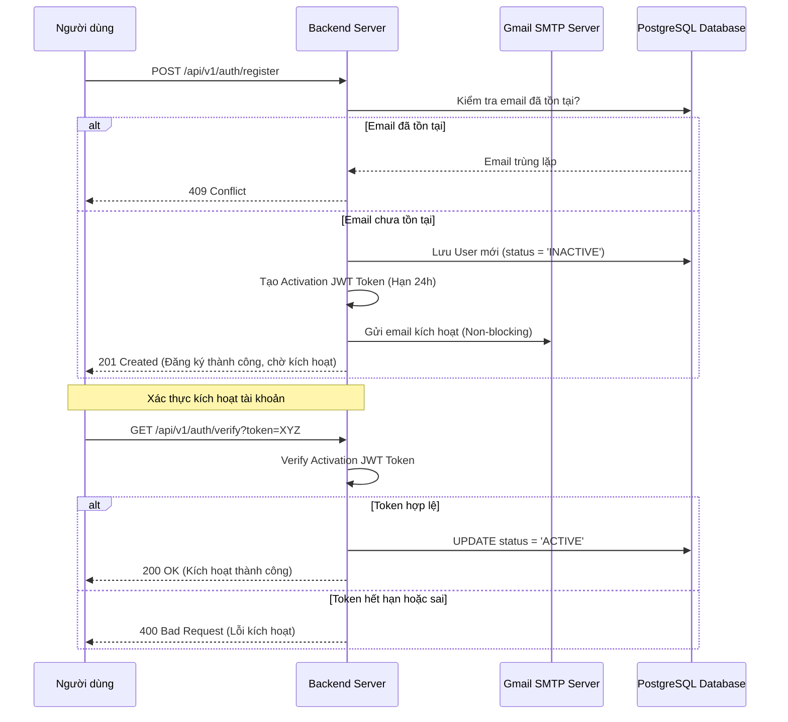
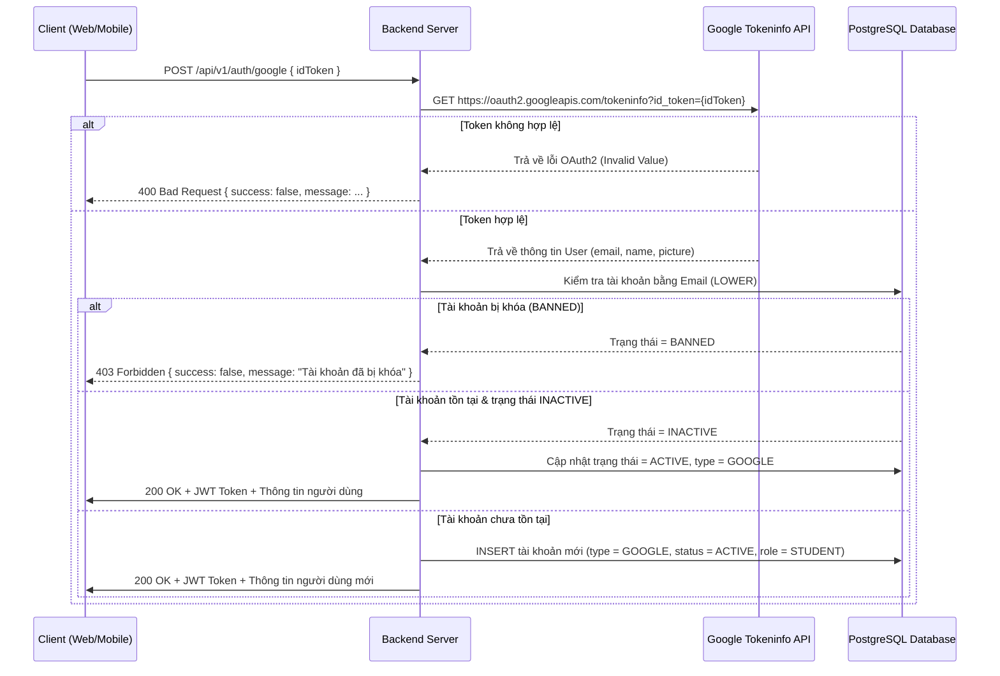

# Hướng dẫn Kỹ thuật - Cấu trúc Authentication & Project

Tài liệu này cung cấp hướng dẫn chi tiết về thiết kế hệ thống, các luồng nghiệp vụ, đặc tả API và hướng dẫn kiểm thử cho toàn bộ hệ thống xác thực (Authentication) và quản lý dự án (Project Management) của dự án.

---

## 1. Hệ thống Logging tùy biến (Custom Logger)

### 1.1. Tổng quan
Để thay thế cho các hàm `console` mặc định của Node.js, hệ thống sử dụng Logger tùy biến tại `src/utils/logger.js` giúp chuẩn hóa thông tin hiển thị trên console.

### 1.2. Phân loại Log Level
*   `logger.info(message)`: Ghi nhận thông tin sự kiện diễn ra thành công (Màu xanh lá).
*   `logger.warn(message)`: Cảnh báo hành động bất thường, nghi ngờ xâm nhập nhưng chưa gây lỗi (Màu vàng).
*   `logger.error(message, error)`: Ghi nhận lỗi hệ thống nghiêm trọng kèm theo `stack trace` chi tiết để phục vụ debug (Màu đỏ).
*   `logger.database(message)`: Ghi nhận trạng thái kết nối cơ sở dữ liệu PostgreSQL (Màu xanh dương).

---

## 2. Tính năng Đăng ký tài khoản (Register) & Xác thực SMTP

### 2.1. Luồng nghiệp vụ
Hệ thống áp dụng phương thức đăng ký bảo mật hai bước (Double Opt-In):
1.  **Đăng ký ban đầu**: Người dùng điền thông tin. Tài khoản được khởi tạo trong Database ở trạng thái mặc định là `'INACTIVE'`.
2.  **Gửi email xác nhận**: Hệ thống sinh ra một **Activation JWT Token** (có thời hạn 24 giờ) chứa thông tin định danh của user và gửi một email HTML chứa liên kết kích hoạt qua SMTP.
3.  **Kích hoạt**: Khi người dùng click vào liên kết, hệ thống giải mã token, kiểm tra tính hợp lệ và cập nhật trạng thái tài khoản thành `'ACTIVE'`.



### 2.2. Đặc tả API Đăng ký
*   **Endpoint**: `/api/v1/auth/register` (Method: `POST`)
*   **Request Body**:
    ```json
    {
      "email": "user@gmail.com",
      "password": "Mật khẩu bảo mật",
      "first_name": "Tên",
      "last_name": "Họ",
      "role": "STUDENT",
      "date_of_birth": "2000-01-27",
      "gender": true
    }
    ```
*   **Response (201 Created)**:
    ```json
    {
      "success": true,
      "message": "Đăng ký tài khoản thành công! Vui lòng kiểm tra email để kích hoạt tài khoản.",
      "data": {
        "user_id": "uuid-cua-tai-khoan",
        "email": "user@gmail.com",
        "status": "INACTIVE"
      }
    }
    ```

### 2.3. Đặc tả API Kích hoạt
*   **Endpoint**: `/api/v1/auth/verify` (Method: `GET`)
*   **Query Params**: `token` (Token JWT nhận được từ Email)
*   **Response (200 OK)**:
    ```json
    {
      "success": true,
      "message": "Kích hoạt tài khoản thành công! Bây giờ bạn đã có thể đăng nhập."
    }
    ```

---

## 3. Tính năng Đăng nhập truyền thống (Local Login)

### 3.1. Luồng nghiệp vụ
1.  Người dùng gửi Email và Mật khẩu.
2.  Hệ thống truy vấn thông tin người dùng trong CSDL.
3.  Kiểm tra loại tài khoản (phải thuộc loại `'LOCAL'`, tài khoản mạng xã hội không hỗ trợ đăng nhập mật khẩu trực tiếp).
4.  Kiểm tra trạng thái tài khoản:
    *   Nếu đang là `'INACTIVE'`: Báo lỗi yêu cầu kích hoạt email trước.
    *   Nếu đang là `'BANNED'`: Báo lỗi tài khoản bị khóa.
5.  So khớp mật khẩu đã mã hóa bằng thư viện `bcrypt`.
6.  Nếu khớp, hệ thống tạo **Access JWT Token** ký bằng khóa bí mật (`JWT_SECRET`) để Client lưu trữ cho các request sau.

### 3.2. Đặc tả API Đăng nhập
*   **Endpoint**: `/api/v1/auth/login` (Method: `POST`)
*   **Request Body**:
    ```json
    {
      "email": "user@gmail.com",
      "password": "Mật khẩu của bạn"
    }
    ```
*   **Response (200 OK)**:
    ```json
    {
      "success": true,
      "message": "Đăng nhập thành công",
      "data": {
        "token": "eyJhbGciOiJIUzI1NiIs...",
        "user": {
          "user_id": "uuid",
          "email": "user@gmail.com",
          "role": "STUDENT",
          "status": "ACTIVE"
        }
      }
    }
    ```

---

## 4. Tính năng Đăng nhập / Đăng ký qua Google

### 4.1. Luồng xử lý chi tiết (Workflow)



### 4.2. Đặc tả API Google Auth
*   **Endpoint**: `/api/v1/auth/google` (Method: `POST`)
*   **Request Body**:
    ```json
    {
      "idToken": "Chuỗi Google ID Token"
    }
    ```
*   **Response (200 OK)**:
    ```json
    {
      "success": true,
      "message": "Đăng nhập bằng Google thành công",
      "data": {
        "token": "eyJhbGciOiJIUzI1Ni...",
        "user": {
          "user_id": "uuid",
          "email": "googleuser@gmail.com",
          "role": "STUDENT",
          "status": "ACTIVE"
        }
      }
    }
    ```
---

## 5. Tính năng Quản lý Dự án Khoa học (Project Management)

### 5.1. Tổng quan
Tính năng Quản lý Dự án Khoa học cho phép người dùng đăng nhập tạo lập, cập nhật, lấy danh sách hoặc xem chi tiết các dự án theo dõi xu hướng ấn phẩm của mình. Mỗi dự án được liên kết với một Lĩnh vực khoa học chính (`Subject_Area`), các Danh mục chuyên ngành (`Subject_Category`) và các Tạp chí khoa học (`Journal`) được quan tâm.

### 5.2. Các ràng buộc dữ liệu & Thiết kế giao dịch (Transactions)
*   **Xác thực người dùng**: Yêu cầu Token xác thực hợp lệ thông qua middleware `requireAuth`. Người dùng chỉ có quyền đọc/ghi các dự án do chính mình sở hữu (`user_id`).
*   **Kiểm tra tính tồn tại (Validation)**: Hệ thống tự động kiểm tra xem các ID của `Subject_Area`, `Subject_Category` và `Journal` có tồn tại trong Cơ sở dữ liệu hay không trước khi tạo/sửa dự án.
*   **Dữ liệu kiểu BIGINT**: Các ID liên quan đến dự án sử dụng kiểu dữ liệu `BIGINT` trong CSDL PostgreSQL để đảm bảo khả năng mở rộng. Trên API, các ID này được trả về ở dạng chuỗi (String) để tránh lỗi tràn số trong JavaScript.
*   **Giao dịch Cơ sở dữ liệu (Database Transactions)**: Các hành động thêm mới hoặc cập nhật dự án cùng các mối quan hệ nhiều-nhiều (trong các bảng trung gian `Subject_Category_Project` và `Project_Journal`) đều được đóng gói trong một Transaction (`BEGIN`/`COMMIT`/`ROLLBACK`) nhằm đảm bảo tính toàn vẹn dữ liệu.

### 5.3. Đặc tả các API Projects
*   **Lấy danh sách dự án của tôi**:
    *   **Endpoint**: `/api/v1/projects` (Method: `GET`)
    *   **Phản hồi (200 OK)**: Trả về danh sách dự án tối giản (gồm `project_id`, `title`, `subject_area`, `created_at`).
*   **Lấy chi tiết một dự án**:
    *   **Endpoint**: `/api/v1/projects/:id` (Method: `GET`)
    *   **Phản hồi (200 OK)**: Trả về thông tin chi tiết của dự án, bao gồm cấu trúc đầy đủ của Lĩnh vực (`subject_area`), mảng Danh mục chuyên ngành (`subject_categories`) và danh sách Tạp chí liên kết (`journals`).
*   **Tạo mới dự án**:
    *   **Endpoint**: `/api/v1/projects` (Method: `POST`)
    *   **Request Body**:
        ```json
        {
          "title": "Dự án nghiên cứu Công nghệ Sinh học",
          "subject_area": 1,
          "subject_category_ids": [10, 11],
          "journal_ids": [201, 202]
        }
        ```
*   **Cập nhật thông tin dự án**:
    *   **Endpoint**: `/api/v1/projects/:id` (Method: `PUT`)
    *   **Request Body**: Truyền các trường cần cập nhật (ví dụ: `title`, `subject_area`, `subject_category_ids`, hoặc `journal_ids`). Hệ thống sẽ tự động xóa các mối quan hệ cũ trong bảng trung gian và thay thế bằng các liên kết mới.
*   **Xóa một dự án**:
    *   **Endpoint**: `/api/v1/projects/:id` (Method: `DELETE`)
    *   **Phản hồi (200 OK)**:
        ```json
        {
          "success": true,
          "message": "Xóa dự án thành công"
        }
        ```

---


## 6. Hướng dẫn Kiểm thử (Testing)

### 6.1. Chạy Kiểm thử thủ công bằng Postman
*   **Local Register**: Gửi request POST tới `/api/v1/auth/register` -> Kiểm tra Gmail để nhận link kích hoạt.
*   **Local Login**: Gửi request POST tới `/api/v1/auth/login` bằng email và mật khẩu vừa kích hoạt.
*   **Google Auth**: 
    1. Truy cập **[Google OAuth2 Playground](https://developers.google.com/oauthplayground)**.
    2. Chọn scope `openid email profile` -> Nhấp **Authorize APIs** -> Đăng nhập tài khoản Google của bạn.
    3. Chọn **Exchange authorization code for tokens** -> Copy giá trị **`id_token`**.
    4. Gửi request POST tới `/api/v1/auth/google` với payload:
       ```json
       {
         "idToken": "DÁN_TOKEN_VÀO_ĐÂY"
       }
       ```
*   **Project Management (CRUD)**:
    *   **Authorization**: Tất cả các request tới API Project yêu cầu gắn Access Token nhận được từ luồng Login vào Header dạng: `Authorization: Bearer <Access_Token>`.
    *   **Tạo dự án mới (`POST /api/v1/projects`)**:
        *   Payload mẫu:
            ```json
            {
              "title": "Dự án mới về Y Sinh",
              "subject_area": 1,
              "subject_category_ids": [2, 3],
              "journal_ids": [105, 106]
            } 
            ```
    *   **Xem danh sách dự án (`GET /api/v1/projects`)**: Nhận danh sách dự án do bạn làm chủ.
    *   **Xem chi tiết dự án (`GET /api/v1/projects/:id`)**: Nhận thông tin chi tiết kèm các liên kết danh mục/tạp chí.
    *   **Cập nhật dự án (`PUT /api/v1/projects/:id`)**:
        *   Payload mẫu:
            ```json
            {
              "title": "Tên dự án mới cập nhật",
              "subject_category_ids": [4]
            }
            ```
    *   **Xóa dự án (`DELETE /api/v1/projects/:id`)**:
        *   **Phương thức (Method)**: `DELETE`
        *   **URL**: `http://localhost:8082/api/v1/projects/<id_dự_án>` (Ví dụ: `http://localhost:8082/api/v1/projects/1`)
        *   **Headers**:
            *   Key: `Authorization`
            *   Value: `Bearer <Access_Token>` (Dán token JWT thu được từ API Đăng nhập/Đăng ký ở bước trên)
        *   **Body**: Chọn `none` (Không cần truyền dữ liệu).
        *   **Kết quả kỳ vọng (Expected Response)**:
            *   **Status Code**: `200 OK`
            *   **Response Body**:
                ```json
                {
                  "success": true,
                  "message": "Xóa dự án thành công"
                }
                ```
            *   Nếu dự án không tồn tại hoặc bạn không sở hữu dự án đó: Trả về `404 Not Found` kèm thông báo `"Không tìm thấy dự án hoặc bạn không có quyền xóa dự án này"`.
            *   Nếu ID dự án truyền vào không phải là số: Trả về `400 Bad Request` kèm thông báo `"ID dự án không hợp lệ"`.


